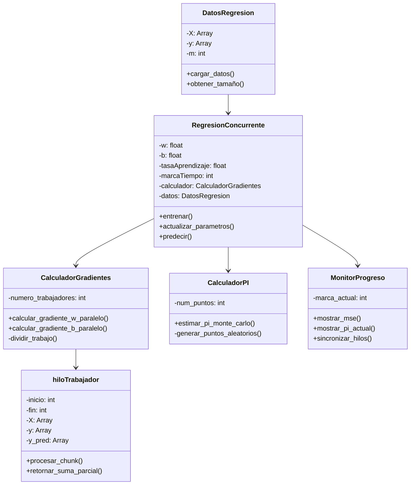
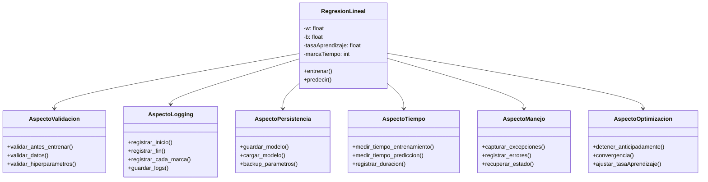

# Punto 1 y 2 - Regresiones lineales

## 1. Diseño con concurrencia y calculo pi

### Explicacion del diseño:

**Componentes principales**:
- **DatosRegresion**: Almacena X, y de forma segura para acceso concurrente
- **CalculadorGradientes**: Coordina múltiples workers para calcular gradientes en paralelo
- **hiloTrabajador**: Cada trabajador procesa un pedazo de los datos
- **RegresionConcurrente**: Organiza todo el flujo
- **CalculadorPI**: Estima pi en segundo plano (métrica de concurrencia)
- **MonitorProgreso**: Sincroniza outputs y muestra métricas

**Ventajas**: Los gradientes se calculan más rápido dividiendo el trabajo entre diferentes nue del procesador.
**Nota**: El numero pi se calculó utilizando el metodo de monte carlo, el cual consiste en que por medio de la estadística y la probabilidad, determinar valores o soluciones de ecuaciones que calculados con exactitud son muy complejas, pero que mediante este método resulta sencillo calcular una aproximación al resultado que buscamos.

---
## 2. Diseño con paradigma de aspectos

### Explicacion del diseño con Aspectos:

**Idea general**: La clase principal de regresión solo se enfoca en lo esencial (entrenar y predecir). Todo lo "extra" se maneja como aspectos que se aplican automáticamente.

**Aspectos (responsabilidades)**:
- **AspectoValidacion**: Revisa que datos y parámetros sean válidos antes de hacer nada
- **AspectoLogging**: Registra qué está pasando en cada paso
- **AspectoPersistencia**: Guarda y carga el modelo
- **AspectoTiempo**: Mide cuánto tarda todo
- **AspectoManejo**: Si algo falla, lo captura y recupera
- **AspectoOptimizacion**: Decide si parar antes de terminar todos las marcas de tiempo

**Ventaja**: Si se necesita agregar una nueva responsabilidad, solo hace fakta crear un nuevo aspecto sin tocar la clase principal.

